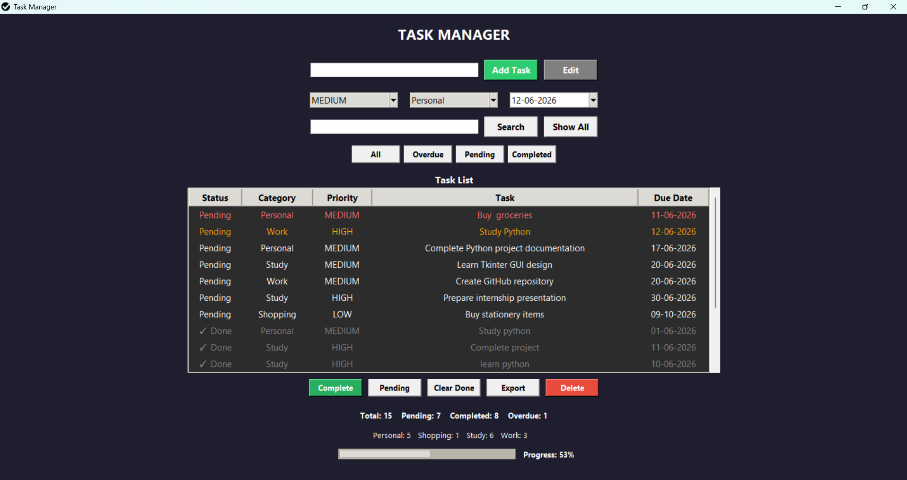

# 🚀 Task Manager Desktop App

A modern desktop **Task Manager application** built using **Python, Tkinter, and SQLite**.

This application helps users organize tasks, track deadlines, manage priorities, and monitor productivity through an intuitive graphical interface.

## 📸 Screenshot




## ✨ Features

- ✅ Add, edit, and delete tasks
- ✅ Mark tasks as Completed or Pending
- 🎯 Priority management (High, Medium, Low)
- 📂 Task categories:
  - Study
  - Work
  - Personal
  - Shopping
  - Other
- 📅 Due date tracking
- ⚠️ Overdue task highlighting
- 🔍 Search tasks instantly
- 🔄 Filter tasks by status
- 📊 Progress tracking bar
- 🔔 Desktop notifications for due and overdue tasks
- 📤 Export tasks to CSV
- 💾 SQLite database storage
- 🖥️ Standalone Windows executable support


## 🛠️ Technologies Used

- Python
- Tkinter (GUI)
- SQLite
- tkcalendar
- Plyer
- PyInstaller
- Git & GitHub


## 📂 Project Structure

```
task-manager-desktop-app/

├── main.py
├── icon.ico
├── settings.json
├── main.spec
├── README.md
├── screenshot.png
└── .gitignore
```


## ▶️ Installation

### 1. Clone the repository

```bash
git clone https://github.com/dharshini-code10/task-manager-desktop-app.git
```

### 2. Navigate to project folder

```bash
cd task-manager-desktop-app
```

### 3. Install dependencies

```bash
pip install tkcalendar plyer
```

### 4. Run application

```bash
python main.py
```


## 📊 Key Functionalities

### 📝 Task Management
- Create new tasks
- Edit existing tasks
- Delete tasks
- Mark tasks as completed or pending


### 📅 Deadline Management
- Set due dates
- Identify overdue tasks
- Highlight today's tasks


### 🔔 Notifications
- Desktop reminders for:
  - Tasks due today
  - Overdue tasks


### 🔍 Search & Filter

- Search tasks by:
  - Task name
  - Category
  - Priority
  - Due date

- Filter tasks by:
  - All
  - Pending
  - Completed
  - Overdue


### 📈 Productivity Tracking

- Total task count
- Completed task count
- Pending task count
- Overdue task count
- Progress percentage


### 📤 Data Export

Export tasks into CSV format for backup and analysis.


## 🎯 Future Improvements

- 🌙 Dark/Light theme switch
- 🔁 Recurring tasks
- ☁️ Backup and restore feature
- 📊 Dashboard analytics
- ⚙️ Custom notification settings
- 👤 User accounts and authentication


## 👩‍💻 Author

**Divyadharshini**

GitHub:  
https://github.com/dharshini-code10


## 📜 License

This project is created for learning, internship, and portfolio purposes.
